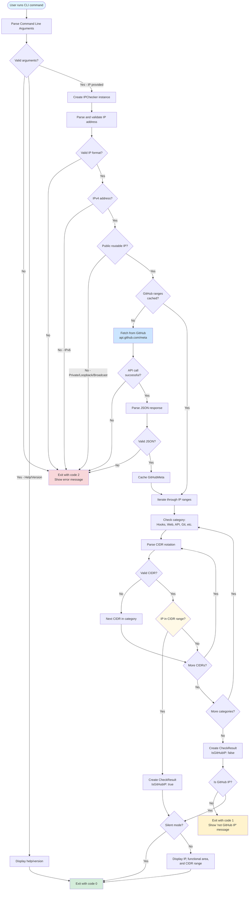

# Architecture and Data Flow

## Overview

`gh-check-github-ip-ranges` is a GitHub CLI extension that validates whether an IP address belongs to GitHub's published IP ranges. The application follows a simple, linear data flow architecture.

## Data Flow Diagram



## Component Architecture

### Main Components

#### 1. **main.go** - CLI Interface Layer
- **Purpose**: Handles command-line interface and user interaction
- **Key Functions**:
  - `main()`: Entry point, sets up Cobra command and processes exit codes
  - `runCommand()`: Orchestrates the IP checking process
- **Responsibilities**:
  - Parse command-line arguments and flags
  - Invoke IP checker
  - Format and display results
  - Determine appropriate exit codes (0, 1, or 2)
  - Handle silent mode

#### 2. **ip_checker.go** - Core Logic Layer
- **Purpose**: Implements IP validation and GitHub range checking
- **Key Components**:
  - `IPChecker`: Main checker struct with HTTP client
  - `GitHubMeta`: Data structure for API response
  - `CheckResult`: Result of IP check operation
- **Key Functions**:
  - `NewIPChecker()`: Creates new checker instance
  - `CheckIP()`: Main validation and checking logic
  - `fetchGitHubMeta()`: Retrieves IP ranges from GitHub API
  - `isBroadcastAddress()`: Helper for IP validation
- **Responsibilities**:
  - Validate IP address format and type
  - Fetch GitHub IP ranges from API
  - Cache API response
  - Check IP against all range categories
  - Return structured results

## Data Structures

### Input Data
```go
// Command line input parsed by Cobra framework
ipAddress string      // IP address argument from CLI
silent    bool        // Silent mode flag (-s, --silent)
```

### API Response
```go
type GitHubMeta struct {
    Hooks       []string  // Webhook IPs
    Web         []string  // Web IPs
    Api         []string  // API IPs
    Git         []string  // Git protocol IPs
    Packages    []string  // Package registry IPs
    Pages       []string  // GitHub Pages IPs
    Importer    []string  // Importer IPs
    Actions     []string  // GitHub Actions IPs
    Dependabot  []string  // Dependabot IPs
    ActionsIPv4 []string  // Actions IPv4-specific
}
```

### Output Data
```go
type CheckResult struct {
    IsGitHubIP     bool    // Whether IP belongs to GitHub
    FunctionalArea string  // Category (Hooks, Web, API, etc.)
    Range          string  // Matching CIDR range
}
```

## Data Flow Details

### 1. Input Phase
1. User executes: `gh check-github-ip-ranges [flags] <ip-address>`
2. Cobra parses arguments and flags
3. Validates exactly one IP argument provided

### 2. Validation Phase
1. Parse IP string to `net.IP` type
2. Validate IPv4 format
3. Check if IP is public/routable (reject private, loopback, multicast, broadcast)

### 3. API Interaction Phase
1. Check if GitHub meta data is cached
2. If not cached:
   - Make HTTP GET request to `https://api.github.com/meta`
   - Validate HTTP status code (200)
   - Decode JSON response into `GitHubMeta` struct
   - Cache the result

### 4. Matching Phase
1. Iterate through 10 functional area categories
2. For each category, iterate through CIDR ranges
3. Parse each CIDR string to `net.IPNet`
4. Skip invalid CIDR entries (defensive programming)
5. Check if IP is contained in CIDR range
6. Return immediately on first match

### 5. Output Phase
1. If match found:
   - In silent mode: exit with code 0
   - In normal mode: print functional area and range, exit with code 0
2. If no match found:
   - Exit with code 1 and error message
3. On any error during processing:
   - Exit with code 2 and error details

## Error Handling Strategy

The application uses a three-tier exit code system:

- **Exit Code 0**: Success - IP belongs to GitHub
- **Exit Code 1**: IP does not belong to GitHub (not an error condition)
- **Exit Code 2**: Error occurred (invalid input, API failure, network error)

### Error Types and Codes

| Error Type | Exit Code | Example |
|------------|-----------|---------|
| Valid GitHub IP | 0 | `192.30.252.1` |
| Non-GitHub IP | 1 | `8.8.8.8` |
| Invalid format | 2 | `invalid-ip` |
| IPv6 not supported | 2 | `2001:db8::1` |
| Private IP | 2 | `192.168.1.1` |
| API error | 2 | Network timeout |
| Missing arguments | 2 | No IP provided |

## External Dependencies

### GitHub API
- **Endpoint**: `https://api.github.com/meta`
- **Method**: GET
- **Rate Limit**: Subject to GitHub API rate limits (60 req/hour unauthenticated)
- **Response Format**: JSON
- **Caching**: Response is cached in memory per IPChecker instance

### Libraries
- **github.com/spf13/cobra**: CLI framework for argument parsing and command structure
- **net/http**: HTTP client for API requests
- **encoding/json**: JSON parsing
- **net**: IP address parsing and CIDR matching

## Performance Considerations

1. **API Caching**: GitHub meta data is fetched once per IPChecker instance
2. **Early Exit**: Matching stops at first CIDR match
3. **Invalid CIDR Handling**: Invalid CIDRs are skipped, not treated as errors
4. **In-Memory Only**: No disk I/O, all processing in memory
5. **Single Request**: Only one API call needed per execution

## Security Considerations

1. **Input Validation**: All IP inputs are thoroughly validated before processing
2. **No Code Execution**: Pure data processing, no dynamic code execution
3. **Read-Only Operations**: No write operations to disk or external systems
4. **HTTPS Only**: API communication over HTTPS
5. **No Credentials**: No authentication credentials stored or transmitted
