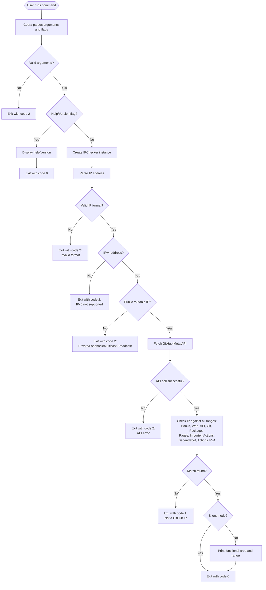

# gh-check-github-ip-ranges

A GitHub CLI extension to check if an IP address is within GitHub's published IP ranges.

## Installation

```bash
gh extension install gclhub/gh-check-github-ip-ranges
```

## Usage

```bash
gh check-github-ip-ranges <ip-address>
```

### Options

- `-s, --silent`: Silent mode - only use exit codes (useful for scripts)

### Exit Codes

- `0`: Success (IP address belongs to GitHub)
- `1`: IP address does not belong to GitHub
- `2`: Invalid input or error condition:
  - Invalid IP address format
  - Non-IPv4 address (IPv6 is not supported)
  - Private, loopback, multicast, or broadcast IP addresses
  - Network errors when fetching GitHub IP ranges
  - API errors from GitHub's meta endpoint
  - Missing command line arguments

### Examples

Check if an IP address belongs to GitHub:
```bash
gh check-github-ip-ranges 192.30.252.1
```

Use in a script with silent mode:
```bash
if gh check-github-ip-ranges -s 192.30.252.1; then
    echo "IP belongs to GitHub"
else
    echo "IP does not belong to GitHub"
fi
```

## Features

- Validates IP address format and routability
- Checks IPv4 addresses against all GitHub IP ranges
- Returns the specific functional area (Actions, API, Git, etc.) for GitHub IPs
- Includes a silent mode for use in scripts
- Supports all GitHub IP range categories from the /meta API endpoint

## Requirements

- GitHub CLI (`gh`) version 2.0.0 or higher
- Go 1.16 or higher (for development)

## Architecture

### Execution Flow

The following diagram illustrates the execution flow of the CLI extension:



### Components

The CLI extension consists of three main Go files:

1. **main.go**: Entry point and command-line interface
   - Defines the Cobra command structure
   - Handles argument parsing and flag processing
   - Manages exit codes (0 for success, 1 for non-GitHub IP, 2 for errors)
   - Implements silent mode for scripting

2. **ip_checker.go**: Core IP checking logic
   - `IPChecker`: Main struct that encapsulates IP checking functionality
   - `GitHubMeta`: Struct representing GitHub's /meta API response
   - `CheckResult`: Struct containing check results
   - Functions:
     - `NewIPChecker()`: Creates new checker instance
     - `CheckIP()`: Validates and checks IP against GitHub ranges
     - `fetchGitHubMeta()`: Retrieves IP ranges from GitHub API
     - `isBroadcastAddress()`: Utility to detect broadcast addresses

3. **Test Files**: Comprehensive test coverage
   - `main_test.go`: Tests for command-line interface
   - `ip_checker_test.go`: Tests for IP checking logic

### Unit Tests Summary

The project includes comprehensive unit tests with 28 total test cases:

#### TestIPChecker_CheckIP (11 test cases)
Tests the core IP checking functionality:
- ✅ Valid GitHub IP detection and functional area identification
- ✅ Non-GitHub IP detection
- ✅ Invalid IP format error handling
- ✅ Private IP rejection
- ✅ IPv6 address rejection
- ✅ Broadcast address rejection
- ✅ API server error handling (500 response)
- ✅ Invalid JSON response handling
- ✅ Network error handling
- ✅ Invalid CIDR format tolerance
- ✅ Mixed valid/invalid CIDR handling

#### TestRunCommand (6 test cases)
Tests the command execution logic:
- ✅ GitHub IP with silent mode
- ✅ GitHub IP without silent mode (with output)
- ✅ Non-GitHub IP with silent mode
- ✅ Non-GitHub IP without silent mode
- ✅ Invalid IP with silent mode
- ✅ Invalid IP without silent mode

#### TestMainFunction (11 test cases)
Tests the main entry point and exit codes:
- ✅ Valid GitHub IP (exit code 0)
- ✅ Non-GitHub IP (exit code 1)
- ✅ Invalid IP format (exit code 2)
- ✅ Private IP (exit code 2)
- ✅ IPv6 address (exit code 2)
- ✅ Broadcast address (exit code 2)
- ✅ No arguments (exit code 2)
- ✅ Help flag (exit code 0)
- ✅ Non-GitHub IP with silent mode (exit code 1)
- ✅ Version flag (exit code 0)
- ✅ Version flag short form (exit code 0)

All tests use mock HTTP servers to simulate GitHub API responses, ensuring reliable and fast test execution without external dependencies.

## Development

To work on this locally:

1. Clone the repository:
```bash
git clone https://github.com/gclhub/gh-check-github-ip-ranges
cd gh-check-github-ip-ranges
```

2. Install the extension from your local directory:
```bash
gh extension remove check-github-ip-ranges  # Remove any existing installation
gh extension install .  # Install from current directory
```

3. Build the extension:
```bash
go build
```

4. Run tests:
```bash
go test ./...
```

Now you can run the extension through `gh` and any changes you make will be reflected after rebuilding:
```bash
gh check-github-ip-ranges <ip-address>
```

To iterate on changes:
1. Make your code changes
2. Run `go build`
3. Test the extension with `gh check-github-ip-ranges`

To enable debug logging, set the `GH_DEBUG` environment variable:
```bash
GH_DEBUG=1 gh check-github-ip-ranges <ip-address>
```

## License

MIT